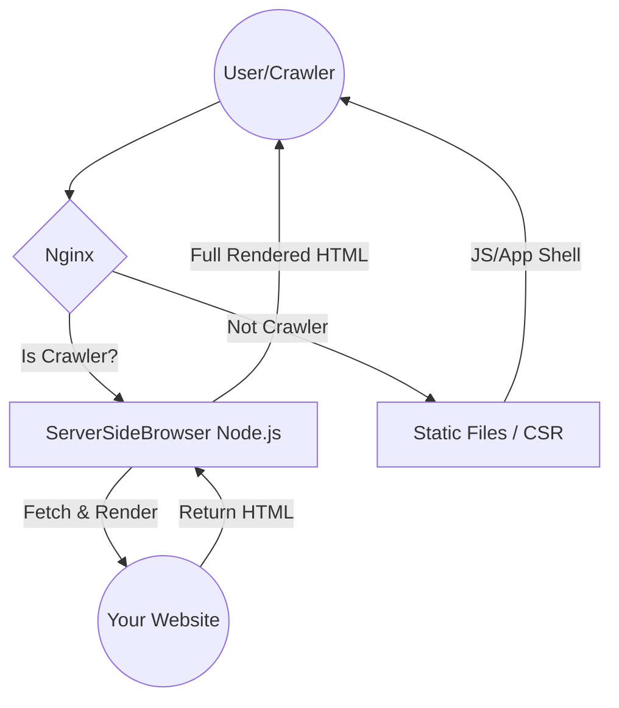

# ServerSideBrowser
Node.js SSR Tool

Server-Side Rendering (SSR) generates HTML content on the server and sends it to the client’s browser, unlike Client-Side Rendering (CSR), which generates content with JavaScript in the browser. SSR improves SEO by speeding up page load times, making it easier for search engines to crawl and index content, enhancing social media sharing with accurate previews, and improving accessibility for assistive technologies. This leads to better search engine rankings and a more user-friendly experience.

## How it work?
The following diagram shows how the SSR tool handles requests from different users (Normal Users vs. Crawlers):



## Requirements
* **Node.js**: Version 18 or later.
* **Browser**: Chrome/Chromium must be installed on the server (required for Puppeteer/Playwright rendering).

## Quick Start

Node.js
```sh
npm install
node index.js
```

Docker
```sh
docker-compose up -d
```

## API

 This service accepts both GET and POST requests.

| Type   | Value  | Description                       |
|--------|--------|-----------------------------------|
| Port   | 9300   | Port listening                    |
| Path   | /render | path to the service              |
| Header | x-url  | URL of the website to be rendered |

### Run it on terminal
```sh
curl -X GET \
  http://localhost:9300/render \
  -H 'x-url: https://www.example.com/path?p=param'
```

## Use on web server

### Nginx
#### Nginx for SEO crawler
 Add this to http block in nginx.conf.
```conf
map $http_user_agent $is_crawler {
    default               0;
    ~*headlesschrome      0; # Ensure the SSR tool itself is not forwarded repeatedly.

    # Mainstream search engines
    ~*googlebot           1;
    ~*adsbot-google       1; # Google ad crawler
    ~*applebot            1; # Apple device search (Siri/Safari)
    ~*bingbot             1;
    ~*duckduckbot         1;
    ~*baidu               1;
    ~*yandex              1;
    ~*yahoo               1;

    # Community platforms and tools
    ~*facebookexternalhit 1;
    ~*twitterbot          1;
    ~*slackbot            1;
    ~*whatsapp            1; # To display the correct preview card on WhatsApp
    ~*linkedinbot         1;
    ~*discordbot          1;
}
```
Add this to server block in nginx vHost.\
\
Option A: Simple (Force all traffic to SSR)
```conf
location / {
  set $full_url "$scheme://$host$request_uri";
  proxy_pass http://127.0.0.1:9300/render;
  proxy_set_header x-url $full_url;
  proxy_set_header Host $host;
  proxy_set_header X-Real-IP $remote_addr;
  proxy_set_header X-Forwarded-For $proxy_add_x_forwarded_for;
  proxy_set_header X-Forwarded-Proto $scheme;
}
```
 Option B: Advance (SEO only - recommended)
```conf
location / {
  if ($is_crawler) {
    rewrite ^ /proxy_to_ssr last;
  }
  # Your original frontend configuration (e.g., try_files $uri /index.html)
  try_files $uri $uri/ /index.html;
}

location /proxy_to_ssr {
  internal;
  set $full_url "$scheme://$host$request_uri";
  proxy_pass http://127.0.0.1:9300/render;
  proxy_set_header x-url $full_url;
  proxy_set_header Host $host;
  proxy_set_header X-Real-IP $remote_addr;
  proxy_set_header X-Forwarded-For $proxy_add_x_forwarded_for;
  proxy_set_header X-Forwarded-Proto $scheme;
}
```

### Test SEO on terminal
 Replace the example.com to your website url.
```sh
curl -v -H "User-Agent: Googlebot" "https://example.com/path?p=param"
```

## License
This project is licensed under the [GNU General Public License v3.0](LICENSE). 
Feel free to use, modify, and distribute it, provided that the same freedoms are preserved.

## Supporting me
  [Donate Link](https://gogetfunding.com/open-source-project-and-library/)\
  Thank you for your support!
