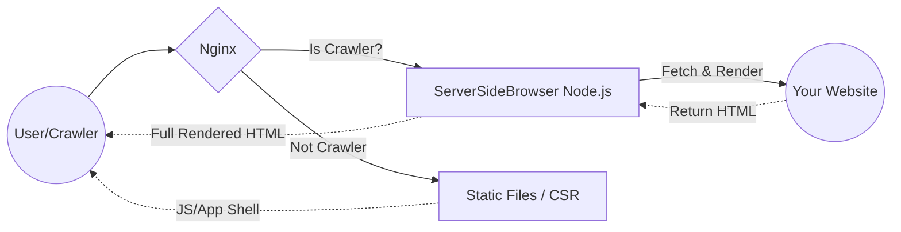

# ServerSideBrowser
## A high-performance Node.js SSR tool designed for modern SPA SEO.

**ServerSideBrowser is a high-performance dynamic rendering proxy that seamlessly adds an SSR layer to your existing Single Page Applications (SPA).**

While Client-Side Rendering (CSR) is great for user experience, search engines and social media bots often struggle to execute JavaScript and index dynamic content. This tool runs a headless browser on your server to fetch, execute, and render your SPA into static HTML before sending it to crawlers. It provides all the SEO and social sharing benefits of Server-Side Rendering **without requiring you to rewrite your frontend codebase into frameworks like Next.js or Nuxt.js.**

## 🚀 Key Features
* **Persistent Browser Instance**: Fast startup and lower CPU overhead by reusing a shared Chromium instance.
* **Smart Resource Filtering**: Automatically skips non-essential assets (**Images, Fonts, Media, WebSockets**) and blocks third-party tracking scripts (GA, FB Pixel) to boost rendering speed.
* **LRU Memory Caching Engine**: Built-in LRU (Least Recently Used) caching with TTL and Cache-Control support for **CSS and JS** to minimize network round-trips while preventing memory leaks.
* **Concurrency Control & Security**: Prevents server overload by limiting maximum concurrent rendering pages (returns HTTP 429), and strict URL validation to prevent SSRF attacks.
* **Production Ready**: Pre-configured for **Docker** (`node:20-slim` with `shm_size: 1g`) and Linux environments.
* **Graceful Shutdown & Auto-Recovery**: Properly cleans up browser processes on service exit and automatically restarts Chromium if it crashes.

## How it work?
The following diagram shows how the SSR tool handles requests from different users (Normal Users vs. Crawlers):



## 📋 Requirements
* **Node.js**: Version 20 or later.
* **Chromium**: Must be installed on the server. (Note: If using Docker, a lightweight Chromium is automatically installed in the `node:20-slim` container.)

## Quick Start

### Node.js (Without Docker)
Install dependencies and start the server with default settings (Port 9300):
```sh
npm install
node index.js
```

**Run with custom settings (Optional):**
You can override the default configurations by passing environment variables before the run command (Linux/macOS):
```sh
PORT=8080 RENDER_PATH=/seo node index.js
```
*(If you are on Windows PowerShell, use: `$env:PORT="8080"; node index.js`)*

### Docker
```sh
docker-compose up -d
```

## ⚙️ Configuration (Environment Variables)

You can easily customize the server's behavior using environment variables. If using Docker, you can set these directly in your `docker-compose.yml`.

| Variable | Default Value | Description |
|----------|---------------|-------------|
| `PORT` | `9300` | The port the server listens on. *(Note: If using Docker, remember to also update the port mapping in `docker-compose.yml`)* |
| `RENDER_PATH` | `/render` | The route path for the SSR service. |
| `USER_AGENT` | `server_side_browser` | The User-Agent string used by Puppeteer when fetching your SPA. |
| `CACHE_TTL` | `1800000` | Time-to-live for cached CSS/JS resources in milliseconds (default is 30 mins). |
| `MAX_CACHE_ITEMS` | `1000` | Maximum number of static resources to keep in the LRU memory cache. |
| `MAX_CONCURRENT_PAGES` | `5` | Maximum number of pages allowed to render simultaneously. Prevents server overload by returning HTTP 429 when exceeded. |
| `MAX_RENDER_PER_BROWSER`| `500` | Number of page renders before the Chromium instance gracefully restarts in the background to clear memory fragments. |

## 🔌 API Reference

This service accepts both GET and POST requests.

> **Note:** The Port, Path, and User Agent listed below are **defaults**. If you have modified them via Environment Variables, please adjust your requests accordingly.

| Type        | Default Value       | Description                       | Required  |
|-------------|---------------------|-----------------------------------|-----------|
| Port        | `9300`                | Port listening                    | -         |
| Path        | `/render`             | Path to the service               | -         |
| User Agent  | `server_side_browser` | User-agent                        | -         |
| Header      | `x-url`               | URL of the website to be rendered | ✅        | 

### Test via Terminal
```sh
curl -X GET \
  http://localhost:9300/render \
  -H 'x-url: https://www.example.com/path?p=param'
```

## 🌐 Web Server Configuration (Nginx)

### 1. Define Crawler Detection
 Add this to the **http** block in nginx.conf:
```conf
map $http_user_agent $is_crawler {
  default               0;
  ~*server_side_browser 0; # Ensure the SSR tool itself is not forwarded repeatedly.

  # Mainstream search engines
  ~*googlebot           1;
  ~*adsbot-google       1; # Google ad crawler
  ~*applebot            1; # Apple device search (Siri/Safari)
  ~*bingbot             1;
  ~*duckduckbot         1;
  ~*baidu               1;
  ~*yandex              1;
  ~*yahoo               1;

  # Community platforms and tools
  ~*facebookexternalhit 1;
  ~*twitterbot          1;
  ~*slackbot            1;
  ~*whatsapp            1; # To display the correct preview card on WhatsApp
  ~*linkedinbot         1;
  ~*discordbot          1;
}
```

### 2. Configure Virtual Host (VHost)
Add this to your **server** block in nginx.conf.\
\
Option A: Simple (Force all traffic to SSR)
```conf
location / {
  set $full_url "$scheme://$host$request_uri";
  proxy_pass http://127.0.0.1:9300/render;
  proxy_set_header x-url $full_url;
  proxy_set_header Host $host;
  proxy_set_header X-Real-IP $remote_addr;
  proxy_set_header X-Forwarded-For $proxy_add_x_forwarded_for;
  proxy_set_header X-Forwarded-Proto $scheme;
}
```
 Option B: Advance (SEO only - recommended)
```conf
location / {
  if ($is_crawler) {
    rewrite ^ /proxy_to_ssr last;
  }
  # Your original frontend configuration (e.g., try_files $uri /index.html)
  try_files $uri $uri/ /index.html;
}

location /proxy_to_ssr {
  internal;
  set $full_url "$scheme://$host$request_uri";
  proxy_pass http://127.0.0.1:9300/render;
  proxy_set_header x-url $full_url;
  proxy_set_header Host $host;
  proxy_set_header X-Real-IP $remote_addr;
  proxy_set_header X-Forwarded-For $proxy_add_x_forwarded_for;
  proxy_set_header X-Forwarded-Proto $scheme;
}
```

### 3. Verify SEO Setup
Test if Googlebot is correctly routed to the SSR service:
```sh
curl -v -H "User-Agent: Googlebot" "https://example.com/path?p=param"
```

## ⚖️ License
This project is licensed under the [GNU General Public License v3.0](LICENSE). 
Feel free to use, modify, and distribute it, provided that the same freedoms are preserved.

## ❤️ Supporting Me
[](https://buymeacoffee.com/cylee99)

Thank you for your support!
